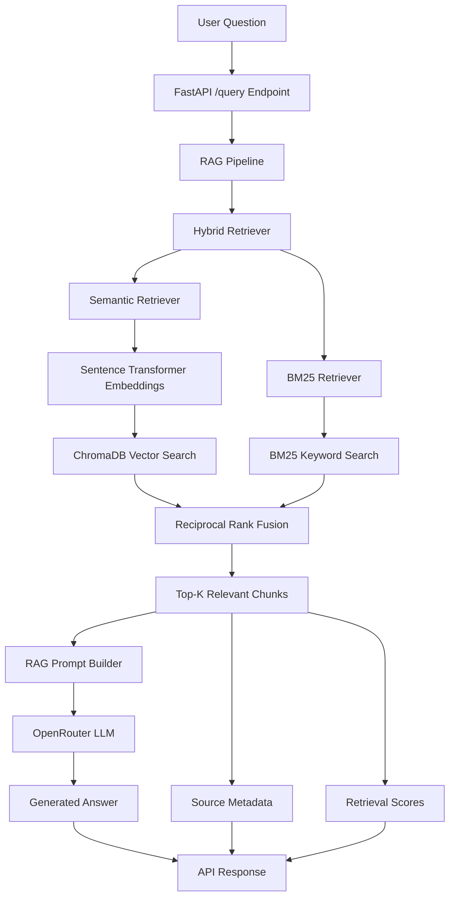
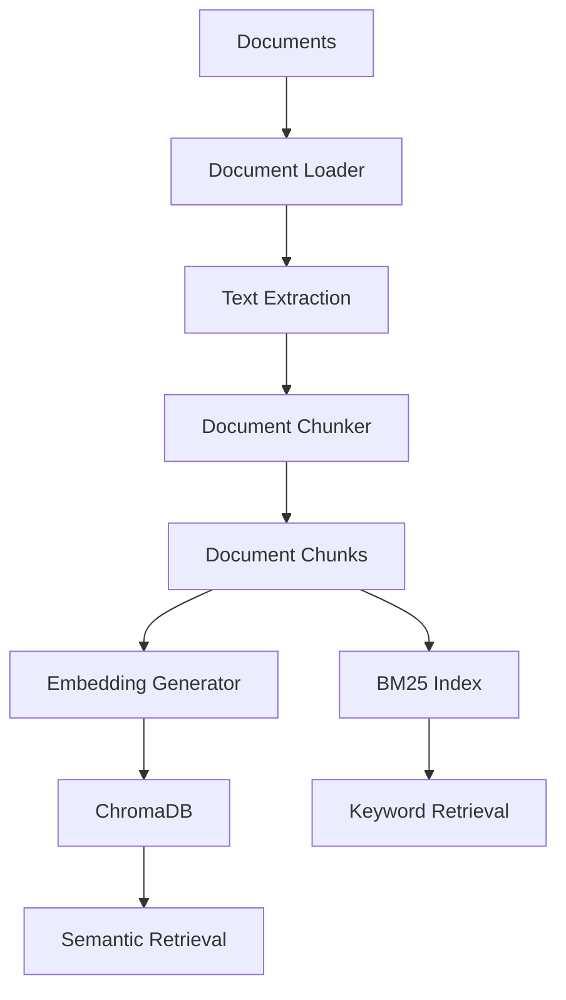
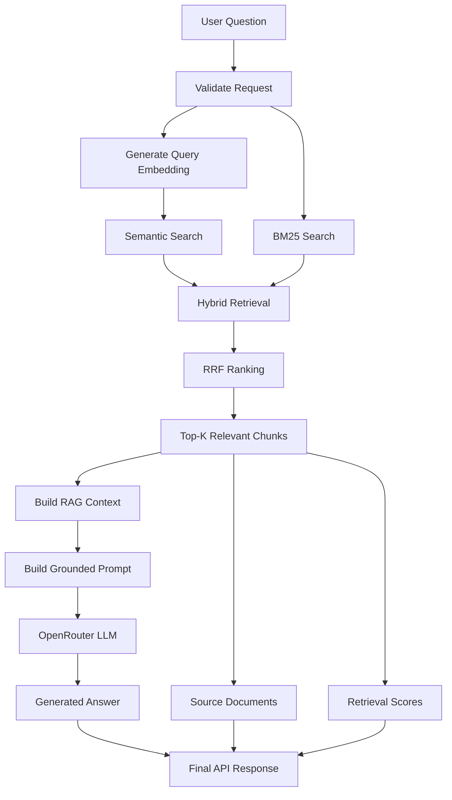

# 🤖 AI RAG Research Assistant

A production-oriented **Retrieval-Augmented Generation (RAG)** application that answers questions using information retrieved from a collection of documents.

The system combines **semantic vector search, BM25 keyword retrieval, Reciprocal Rank Fusion (RRF), and LLM-based answer generation** to provide grounded responses with source references and retrieval scores.

---

## 🚀 Overview

The AI RAG Research Assistant is designed as an end-to-end RAG system rather than a simple LLM chatbot.

It follows the pipeline:

**Documents → Ingestion → Chunking → Embeddings → ChromaDB + BM25 → Hybrid Retrieval → Context Construction → LLM Generation → Answer + Sources**

The application exposes the RAG pipeline through a **FastAPI REST API** and provides interactive API documentation through Swagger UI.

---

## ✨ Key Features

- 📄 PDF, TXT, and Markdown document ingestion
- ✂️ Configurable document chunking
- 🧠 Sentence Transformer embeddings
- 🔎 Semantic vector search using ChromaDB
- 🔤 BM25 keyword-based retrieval
- 🔀 Hybrid retrieval using Reciprocal Rank Fusion (RRF)
- 🎯 Configurable `top_k` retrieval
- 🤖 LLM-powered answer generation
- 🌐 OpenRouter integration for LLM inference
- 📚 Source attribution for retrieved documents
- 📊 Retrieval scores returned with API responses
- ⚡ FastAPI REST API
- 📖 Swagger/OpenAPI documentation
- 💾 Persistent ChromaDB vector storage
- 🧪 Comprehensive unit test suite
- 📈 Retrieval evaluation metrics
- 🔐 Environment-based API key configuration
- 🧩 Modular architecture with separated application layers

---

## 🏗️ System Architecture



---

## 📚 Document Indexing Flow



---

## 🔍 Query / RAG Flow



---

# 🛠️ Technology Stack

## Programming Language

- Python 3.12+

## API

- FastAPI
- Uvicorn
- Pydantic

## Retrieval

- ChromaDB
- BM25
- Reciprocal Rank Fusion (RRF)
- Hybrid Retrieval

## Embeddings

- Sentence Transformers
- `sentence-transformers/all-MiniLM-L6-v2`

## LLM

- OpenRouter
- OpenAI-compatible API interface
- Configurable LLM model

## Document Processing

- PyPDF
- TXT
- Markdown
- Custom document chunking

## Testing

- Pytest
- 72 unit tests

## Configuration

- Python Dotenv
- Environment variables

---

# 📂 Project Structure

```text
AI-RAG-Research-Assistant/
│
├── app/
│   ├── __init__.py
│   │
│   ├── api/
│   │   ├── __init__.py
│   │   ├── routes.py
│   │   └── schemas.py
│   │
│   ├── config/
│   │   ├── __init__.py
│   │   └── settings.py
│   │
│   ├── embeddings/
│   │   ├── __init__.py
│   │   └── embedder.py
│   │
│   ├── evaluation/
│   │   ├── __init__.py
│   │   ├── evaluator.py
│   │   └── metrics.py
│   │
│   ├── generation/
│   │   ├── __init__.py
│   │   ├── generator.py
│   │   └── prompts.py
│   │
│   ├── indexing/
│   │   ├── __init__.py
│   │   └── indexer.py
│   │
│   ├── ingestion/
│   │   ├── __init__.py
│   │   ├── chunker.py
│   │   ├── loader.py
│   │   └── models.py
│   │
│   ├── pipeline/
│   │   ├── __init__.py
│   │   └── rag_pipeline.py
│   │
│   ├── retrieval/
│   │   ├── __init__.py
│   │   ├── bm25.py
│   │   ├── hybrid.py
│   │   ├── retriever.py
│   │   └── vector_store.py
│   │
│   ├── storage/
│   │   ├── __init__.py
│   │   └── chroma_store.py
│   │
│   └── main.py
│
├── tests/
│   └── unit/
│       ├── test_api.py
│       ├── test_bm25.py
│       ├── test_chroma_store.py
│       ├── test_chunker.py
│       ├── test_embeddings.py
│       ├── test_evaluation.py
│       ├── test_generation.py
│       ├── test_hybrid.py
│       ├── test_indexer.py
│       ├── test_ingestion.py
│       ├── test_rag_pipeline.py
│       └── test_retrieval.py
│
├── data/
│   └── raw/
│       └── sample/
│           └── python.txt
│
├── .env.example
├── .gitignore
├── LICENSE
├── requirements.txt
└── README.md
```

---

# 🔄 Application Components

## 1. Document Ingestion

The ingestion layer loads supported documents and converts them into a consistent internal document representation.

Supported formats include:

- PDF
- TXT
- Markdown

The ingestion layer is responsible for:

- Loading documents
- Extracting text
- Preserving source metadata
- Creating document objects

---

## 2. Document Chunking

Large documents are divided into smaller chunks before embedding.

Chunking provides:

- Better retrieval precision
- More manageable context sizes
- Improved semantic search
- Source-level traceability

Each chunk maintains metadata such as its source document and deterministic chunk identifier.

---

## 3. Embedding Generation

The project uses:

```text
sentence-transformers/all-MiniLM-L6-v2
```

to convert document chunks and user queries into numerical vector representations.

These embeddings allow the system to perform semantic similarity search.

---

## 4. Vector Search

ChromaDB is used as the persistent vector storage layer.

The vector retrieval process is:

```text
User Query
    ↓
Query Embedding
    ↓
ChromaDB Similarity Search
    ↓
Relevant Document Chunks
```

ChromaDB provides persistent storage so indexed documents can be reused between application executions.

---

## 5. BM25 Retrieval

The application also maintains a BM25 keyword retrieval index.

BM25 is useful when exact terminology matters.

For example, a query containing a specific technical term can benefit from keyword-based retrieval even when semantic similarity is weaker.

The BM25 retrieval process is:

```text
User Query
    ↓
Tokenization
    ↓
BM25 Keyword Search
    ↓
Relevant Chunks
```

---

# 🔀 Hybrid Retrieval

Instead of relying exclusively on semantic search or keyword search, the application combines both retrieval strategies.

```text
                 User Query
                     |
          +----------+----------+
          |                     |
          ↓                     ↓
   Semantic Search          BM25 Search
          |                     |
          ↓                     ↓
   Vector Results          Keyword Results
          |                     |
          +----------+----------+
                     |
                     ↓
        Reciprocal Rank Fusion
                     |
                     ↓
              Final Ranking
                     |
                     ↓
                Top-K Chunks
```

This approach improves retrieval robustness by combining:

- Semantic similarity
- Exact keyword matching
- Independent retrieval rankings

---

# 🎯 Reciprocal Rank Fusion

The hybrid retriever uses **Reciprocal Rank Fusion (RRF)** to combine the rankings returned by the semantic and BM25 retrievers.

Conceptually:

```text
RRF Score = Σ 1 / (k + rank)
```

Documents appearing near the top of multiple retrieval systems receive stronger combined rankings.

This allows documents that are independently relevant through both semantic and lexical retrieval to be promoted.

---

# 🤖 RAG Generation

After retrieval, the selected chunks are converted into a grounded context.

The prompt instructs the LLM to:

1. Use only the retrieved context.
2. Answer the user's question.
3. Avoid unsupported information.
4. State that information is unavailable when the answer cannot be found in the supplied documents.

The flow is:

```text
Retrieved Chunks
       ↓
Context Construction
       ↓
RAG Prompt
       ↓
OpenRouter
       ↓
LLM Response
       ↓
Final Answer
```

---

# 🌐 OpenRouter Integration

The production generation layer uses **OpenRouter** rather than directly calling the OpenAI API.

OpenRouter provides an OpenAI-compatible API interface and allows the LLM model to be configured through environment variables.

Example configuration:

```env
OPENROUTER_API_KEY=your_openrouter_api_key
OPENROUTER_MODEL=openai/gpt-4o-mini
```

The API key should never be committed to Git.

---

# ⚙️ Configuration

Create a `.env` file in the project root.

Example:

```env
# OpenRouter
OPENROUTER_API_KEY=your_openrouter_api_key
OPENROUTER_MODEL=openai/gpt-4o-mini

# Embeddings
EMBEDDING_MODEL=sentence-transformers/all-MiniLM-L6-v2

# Retrieval
TOP_K=5
RERANK_TOP_K=3

# Application
APP_ENV=development
LOG_LEVEL=INFO
```

The repository contains `.env.example` as a safe configuration template.

### Important

Do **not** commit:

```text
.env
```

The `.gitignore` file excludes environment variables and local application data.

---

# 📦 Installation

## 1. Clone the repository

```bash
git clone https://github.com/kavs889/AI-RAG-Research-Assistant.git
```

## 2. Navigate into the project

```bash
cd AI-RAG-Research-Assistant
```

## 3. Create a virtual environment

### Windows

```powershell
python -m venv .venv
```

## 4. Activate the virtual environment

```powershell
.venv\Scripts\Activate.ps1
```

If PowerShell activation is restricted, you can directly use the Python executable inside `.venv`.

## 5. Install dependencies

```powershell
.venv\Scripts\python.exe -m pip install -r requirements.txt
```

---

# 🔐 Configure Environment Variables

Copy the example environment file:

```powershell
Copy-Item .env.example .env
```

Then open `.env`:

```powershell
code .env
```

Add your OpenRouter credentials:

```env
OPENROUTER_API_KEY=your_actual_key
OPENROUTER_MODEL=openai/gpt-4o-mini
```

Never publish your actual API key.

---

# ▶️ Run the Application

Start the FastAPI application using Uvicorn:

```powershell
.venv\Scripts\python.exe -m uvicorn app.main:app --reload
```

The application will start at:

```text
http://127.0.0.1:8000
```

---

# 📖 Swagger API Documentation

FastAPI automatically provides interactive API documentation.

Open:

```text
http://127.0.0.1:8000/docs
```

You can use Swagger UI to execute RAG queries directly from the browser.

---

# 🔎 Query API

## Endpoint

```text
POST /query
```

## Request

```json
{
  "question": "What is Python?",
  "top_k": 5
}
```

## Example cURL

```bash
curl -X POST "http://127.0.0.1:8000/query" \
  -H "accept: application/json" \
  -H "Content-Type: application/json" \
  -d "{\"question\":\"What is Python?\",\"top_k\":5}"
```

---

# 📤 Example Response

```json
{
  "answer": "Python is a high-level programming language known for its readability and simplicity. It is widely used for data engineering, machine learning, artificial intelligence, web development, automation, and scientific computing.",
  "sources": [
    {
      "chunk_id": "ca2f391c933118b2",
      "source": "data\\raw\\sample\\python.txt"
    }
  ],
  "retrieval_scores": [
    0.03278688524590164
  ]
}
```

The response contains:

### `answer`

The final answer generated by the LLM using the retrieved context.

### `sources`

The document chunks used as supporting context.

### `retrieval_scores`

The scores associated with the retrieved results.

---

# ❌ API Validation

The API validates incoming requests.

Examples of invalid requests include:

### Empty question

```json
{
  "question": "",
  "top_k": 5
}
```

### Whitespace-only question

```json
{
  "question": "   ",
  "top_k": 5
}
```

### Invalid `top_k`

```json
{
  "question": "What is Python?",
  "top_k": 0
}
```

Invalid requests are rejected instead of being sent through the retrieval and generation pipeline.

---

# 🧪 Testing

The project includes a comprehensive unit test suite covering the major components.

Run all unit tests:

```powershell
.venv\Scripts\python.exe -m pytest tests\unit -v
```

Current test suite:

```text
72 passed
```

Example:

```text
================================================= test session starts =================================================

collected 72 items

...

================================================= 72 passed =================================================
```

---

# 🧪 Test Coverage Areas

The unit tests cover:

## API

- Query endpoint
- Default `top_k`
- Empty questions
- Whitespace questions
- Invalid `top_k`
- Response structure

## BM25

- Keyword retrieval
- Result ranking
- `top_k`
- Scores
- Empty queries
- Empty collections

## ChromaDB

- Vector insertion
- Similarity search
- Persistence
- Multiple chunk insertion
- `top_k`
- Invalid inputs
- Delete operations
- Clear operations

## Chunking

- Long document splitting
- Metadata preservation
- Deterministic chunk IDs
- Short documents
- Empty documents
- Invalid configuration

## Embeddings

- Single text embedding
- Multiple text embeddings
- Deterministic embeddings
- Empty text validation

## Evaluation

- Precision@K
- Recall@K
- Reciprocal Rank
- NDCG
- Empty results
- Invalid K
- Multiple K evaluation

## Generation

- RAG prompt creation
- Question validation
- Context validation
- LLM invocation
- Prompt propagation
- Answer generation

## Hybrid Retrieval

- Combining retrievers
- Result ranking
- `top_k`
- Query validation
- Reciprocal Rank Fusion

## Indexing

- Directory indexing
- Supported document processing
- BM25 indexing
- Invalid directories
- Invalid paths

## Ingestion

- TXT loading
- Markdown loading
- PDF loading
- Unsupported file types

## RAG Pipeline

- Retrieval + generation integration
- `top_k`
- Question validation
- Empty questions
- Invalid `top_k`

## Retrieval

- Vector search
- Similarity ranking
- `top_k`
- Query embeddings
- Query validation

---

# 📊 Retrieval Evaluation

The project includes a dedicated evaluation layer.

Implemented metrics include:

```text
Precision@K
Recall@K
Reciprocal Rank
NDCG@K
```

These metrics help evaluate whether relevant documents are being retrieved and ranked effectively.

---

# 🧩 Modular Architecture

The application separates responsibilities into independent layers.

```text
API Layer
    ↓
RAG Pipeline
    ↓
Retrieval Layer
    ↓
Generation Layer
```

Supporting components include:

```text
Ingestion
    ↓
Chunking
    ↓
Embeddings
    ↓
Indexing
    ↓
Storage
```

This separation makes the system easier to:

- Test
- Maintain
- Extend
- Replace individual components
- Experiment with different retrieval strategies
- Change LLM providers

---

# 📌 Design Principles

The project follows several engineering principles:

### Separation of concerns

Each layer has a specific responsibility.

### Dependency abstraction

Retrieval and generation components are designed around interfaces that allow implementations to be replaced.

### Deterministic processing

Document chunk identifiers and embedding behavior are designed to remain reproducible.

### Validation-first design

Invalid inputs are rejected at the appropriate layer.

### Grounded generation

The LLM is instructed to answer using retrieved context rather than relying on unsupported information.

### Testability

Core components can be tested independently using mocked dependencies.

### Configuration through environment variables

Secrets and environment-specific configuration are kept outside the source code.

---

# 🔐 Security Considerations

Never commit API keys or credentials.

The following should remain local:

```text
.env
```

Local generated data is also excluded from version control.

The repository intentionally uses:

```text
.env.example
```

to document required configuration without exposing secrets.

---

# 📈 Current Project Status

The current implementation includes:

- ✅ Document ingestion
- ✅ Document chunking
- ✅ Sentence Transformer embeddings
- ✅ ChromaDB vector storage
- ✅ BM25 retrieval
- ✅ Hybrid retrieval
- ✅ Reciprocal Rank Fusion
- ✅ RAG prompt construction
- ✅ OpenRouter LLM integration
- ✅ FastAPI API
- ✅ Swagger documentation
- ✅ Source attribution
- ✅ Retrieval scores
- ✅ Evaluation metrics
- ✅ Unit tests
- ✅ Persistent vector storage
- ✅ Environment-based configuration
- ✅ Production-oriented project structure

---

# 🚀 Future Improvements

Potential future enhancements include:

- 🌐 Streamlit or React frontend
- 💬 Multi-turn conversational memory
- 📚 Multi-document upload API
- 📄 Document management endpoints
- 🔄 Background document indexing
- ⚡ Async retrieval and generation
- 🧠 Cross-encoder reranking
- 📊 RAG quality dashboards
- 📈 Retrieval and generation observability
- 🧪 Automated RAG evaluation datasets
- 🐳 Docker containerization
- ☁️ Cloud deployment
- 🔐 Authentication and authorization
- 📡 Streaming LLM responses
- 🗂️ Metadata filtering
- 🧹 Automated document lifecycle management
- 📊 Production monitoring and logging

---

# 🏆 Why This Project Matters

This project demonstrates an end-to-end implementation of a modern RAG system rather than simply calling an LLM API.

It covers the complete workflow:

```text
Raw Documents
      ↓
Document Processing
      ↓
Chunking
      ↓
Embedding Generation
      ↓
Vector Indexing
      ↓
Keyword Indexing
      ↓
Hybrid Retrieval
      ↓
Rank Fusion
      ↓
Context Construction
      ↓
Grounded LLM Generation
      ↓
API Response
      ↓
Sources + Retrieval Scores
```

The architecture is designed to demonstrate practical skills across:

- Data engineering
- Information retrieval
- Machine learning
- Natural language processing
- LLM application development
- API development
- Software engineering
- Testing
- Evaluation
- Production-oriented system design

---

# 👩‍💻 Author

**Kavya Varma Palukuru**

Data Engineer | AI/ML Engineer

📍 Atlanta, GA

LinkedIn:  
https://www.linkedin.com/in/kavya-varma-palukuru-844b151b8/

GitHub:  
https://github.com/kavs889

---

# 📄 License

This project is licensed under the MIT License.

See the `LICENSE` file for details.

---

# ⭐ Project

If you find this project useful, consider giving the repository a star.

**AI-RAG-Research-Assistant**

Built with Python, FastAPI, ChromaDB, BM25, Sentence Transformers, and OpenRouter.
